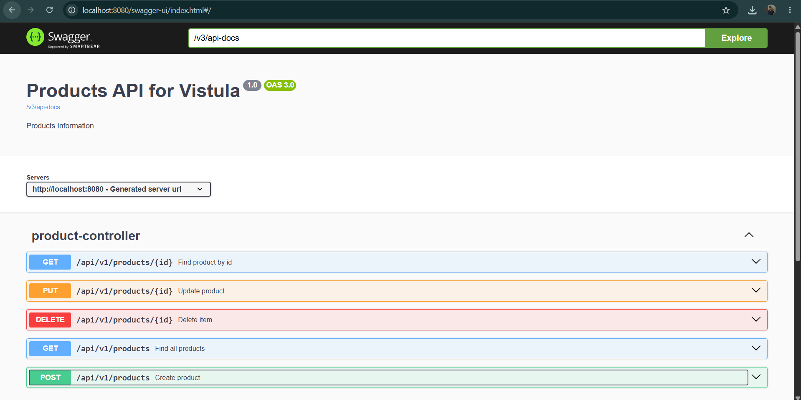
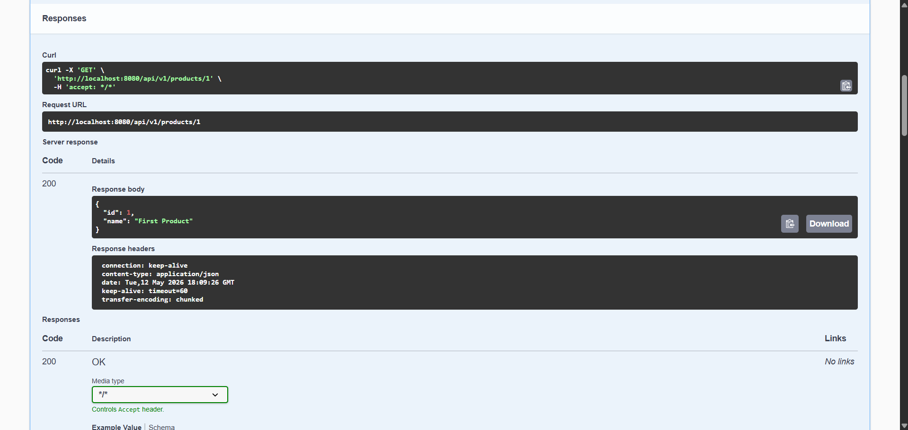
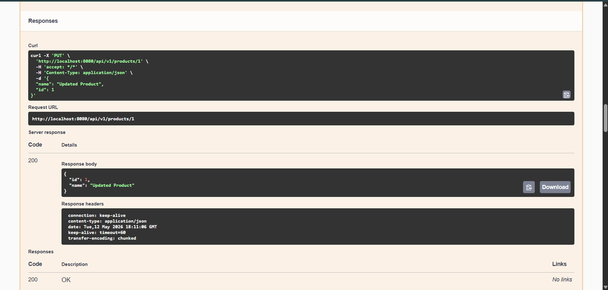
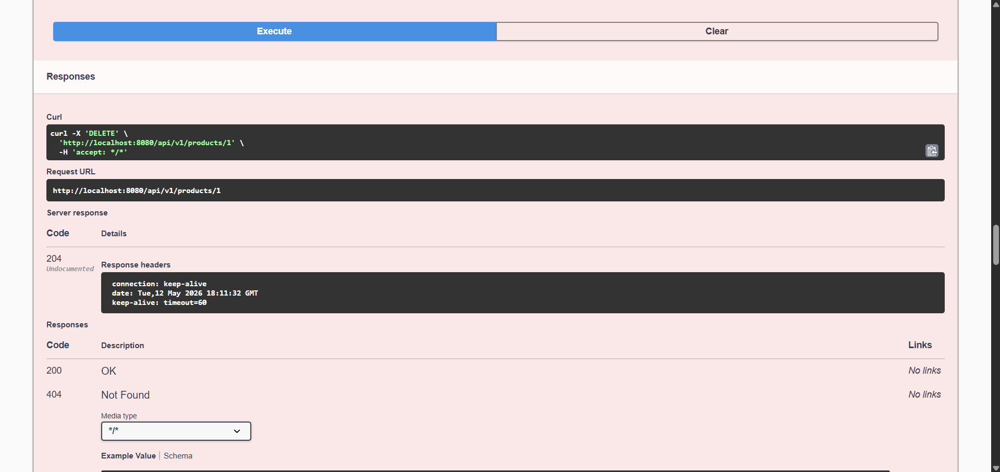
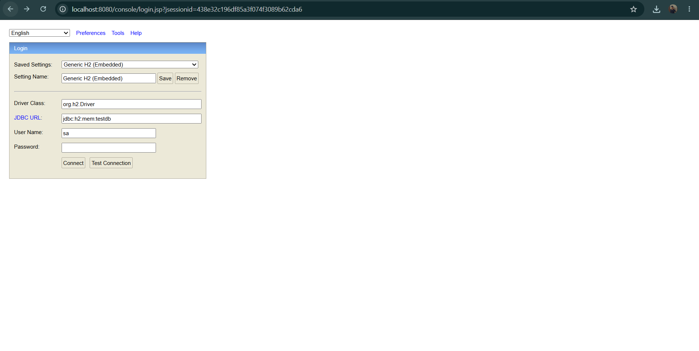
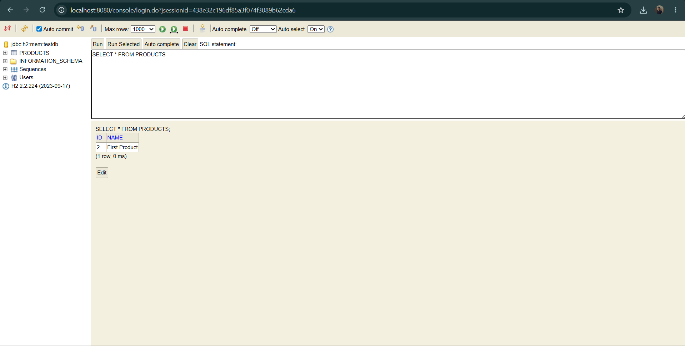

# First REST API Spring - Task 2

## Project Description
A REST API application built with Spring Boot that manages products.
The application supports full CRUD operations (Create, Read, Update, Delete)
and includes Swagger UI for testing and documentation.

---

## Technologies Used
- Java 17
- Spring Boot 3.3.5
- Spring Data JPA
- H2 In-Memory Database
- Swagger UI (SpringDoc OpenAPI 2.8.8)
- Maven

---

## Project Structure
first-rest-api-spring/
├── src/
│   └── main/
│       ├── java/
│       │   └── pl/edu/vistula/firstrestapising/
│       │       ├── product/
│       │       │   ├── api/
│       │       │   │   ├── ProductController.java
│       │       │   │   ├── request/
│       │       │   │   │   ├── ProductRequest.java
│       │       │   │   │   └── UpdateProductRequest.java
│       │       │   │   └── response/
│       │       │   │       └── ProductResponse.java
│       │       │   ├── domain/
│       │       │   │   └── Product.java
│       │       │   ├── repository/
│       │       │   │   └── ProductRepository.java
│       │       │   ├── service/
│       │       │   │   └── ProductService.java
│       │       │   └── support/
│       │       │       ├── ProductMapper.java
│       │       │       ├── exception/
│       │       │       │   └── ProductNotFoundException.java
│       │       │       └── ProductExceptionSupplier.java
│       │       ├── shared/
│       │       │   └── api/
│       │       │       └── response/
│       │       │           └── ErrorMessageResponse.java
│       │       └── FirstRestApiSpringApplication.java
│       └── resources/
│           └── application.properties
├── .gitignore
├── pom.xml
└── README.md

---

## How to Run the Application

### Prerequisites
- IntelliJ IDEA
- Java 17 or higher
- Maven

### Steps
1. Clone the repository
2. Open the project in IntelliJ IDEA
3. Wait for Maven to download dependencies
4. Run `FirstRestApiSpringApplication.java`
5. Application starts on port 8080

---

## How to Test the Application

### Using Swagger UI
Open your browser and go to:

http://localhost:8080/swagger-ui/index.html

---

## API Endpoints

### 1. Create a Product
- **Method:** POST
- **URL:** `http://localhost:8080/api/v1/products`
- **Request Body:**
```json
{
  "name": "First product"
}
```
- **Response (201 Created):**
```json
{
  "id": 1,
  "name": "First product"
}
```

---

### 2. Get Product by ID
- **Method:** GET
- **URL:** `http://localhost:8080/api/v1/products/1`
- **Response (200 OK):**
```json
{
  "id": 1,
  "name": "First product"
}
```

---

### 3. Get All Products
- **Method:** GET
- **URL:** `http://localhost:8080/api/v1/products`
- **Response (200 OK):**
```json
[
  {
    "id": 1,
    "name": "First product"
  },
  {
    "id": 2,
    "name": "Second product"
  }
]
```

---

### 4. Update a Product
- **Method:** PUT
- **URL:** `http://localhost:8080/api/v1/products/1`
- **Request Body:**
```json
{
  "name": "Updated product"
}
```
- **Response (200 OK):**
```json
{
  "id": 1,
  "name": "Updated product"
}
```

---

### 5. Delete a Product
- **Method:** DELETE
- **URL:** `http://localhost:8080/api/v1/products/1`
- **Response:** 204 No Content

---

### 6. Get Product that Does Not Exist (Exception Handling)
- **Method:** GET
- **URL:** `http://localhost:8080/api/v1/products/999`
- **Response (404 Not Found):**
```json
{
  "message": "Product with 999 not found"
}
```

---

## Database
The application uses H2 in-memory database. The database is created
automatically when the application starts and the PRODUCTS table is
generated by Hibernate based on the Product entity.

### Database Schema
```sql
CREATE TABLE PRODUCTS (
                          ID BIGINT NOT NULL,
                          NAME VARCHAR(255),
                          PRIMARY KEY (ID)
);
```

---

## Package Descriptions

| Package | Description |
|---|---|
| `product.api` | Contains the REST controller that handles HTTP requests |
| `product.api.request` | Classes for incoming HTTP request data |
| `product.api.response` | Classes for outgoing HTTP response data |
| `product.domain` | The Product entity class |
| `product.repository` | JPA repository interface for database operations |
| `product.service` | Business logic layer |
| `product.support` | Helper classes including mapper and exception handling |
| `shared.api.response` | Shared response classes used across the application |

---

## Annotations Used

| Annotation | Description |
|---|---|
| `@RestController` | Marks the class as a REST controller |
| `@RequestMapping` | Maps HTTP requests to handler methods |
| `@PostMapping` | Handles HTTP POST requests |
| `@GetMapping` | Handles HTTP GET requests |
| `@PutMapping` | Handles HTTP PUT requests |
| `@DeleteMapping` | Handles HTTP DELETE requests |
| `@Service` | Marks the class as a service component |
| `@Repository` | Marks the interface as a repository |
| `@Component` | Marks the class as a Spring component |
| `@Entity` | Marks the class as a JPA entity |
| `@ControllerAdvice` | Handles exceptions globally |
| `@ExceptionHandler` | Handles specific exception types |

---

## Screenshots

### Swagger UI



### POST - Create a Product


### GET - Get Product by ID


### PUT - Update a Product


### DELETE - Delete a Product


### H2 Database Console
To access the H2 database console, make sure the application is running
and go to:

http://localhost:8080/console

On the login page enter the following details:
- **JDBC URL:** `jdbc:h2:mem:testdb`
- **User Name:** `sa`
- **Password:** leave empty

Then click **Connect**.



### H2 Database - SELECT * FROM PRODUCTS
After connecting to the H2 console, run the following SQL query
to see all products stored in the database:

```sql
SELECT * FROM PRODUCTS
```

